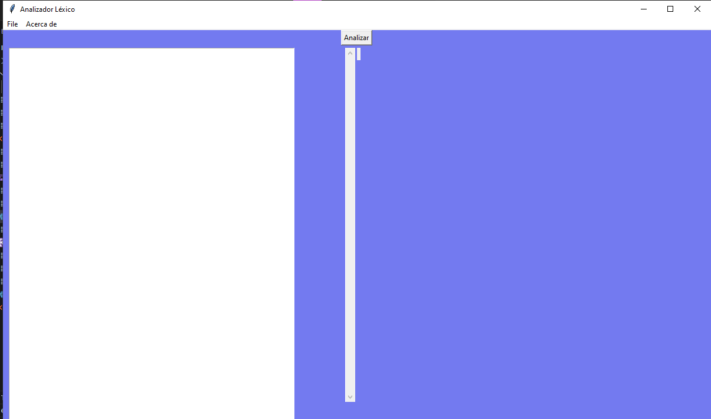

# Manual de usuario 
###### Natalia Garrido  carnet 202201385 
## introduccion 
a continuacion se le presentara el uso de una interfaz en el cual lee un cierto tipo de documento, este en su backend considerara su analisis lexico y su interpretacion donde se leera un documento el cual se analizara si el formato es el esperado de ser asi se creara una grafica mostrando por colores cuales son las opciones mas obvias 

## inicio
Lo que encontraremos en el  la interfaz sera lo siguiente 

esta vendria siendo como se visualiza la interfaz 

 
 en la parte superior podemos encontrar un menu con varias partes  hablaremos de esas 
 

 - open 
	 - en esta se abre un archivo que tengamos guardado y lo imprime o lo muestra en el area de texto 
- save
	- esta parte guarda lo que tengamos en el area de texto
- save as
	- esta parte nos permite elegir como y donde guardar lo que tengamos en el area de texto 
- exit 
	- al apachar esta area lo que hace es que cierra el programa 
- acerca de 
	-  en esta area encontraran los datos del estudiante

### area de trabajo 

en esta encontraremos  
- *area de texto*
	- aca se mostrara los archivos leidos y puede ser modificado 
- *boton analizar*
- *area de grafica*
### la grafica 

al dar click en el boton analizar  y confirmar que en el backend que no hay errores en el archivo entonces generara un grafico donde hasta arriba se mostrara el nombre de la grafica, en el segundo nivel estaran los continenetes y en el tercero se encontrara el pais con sus respectivos datos. 

pero tanto los paises como los continentes  van a tener diferentes colores dependiendo de su saturacion esta seria el modulo de colores 
#### colores 

| saturacion |color |
| ------ | ------ |
|  0% - 15% |  Blanco|
| 16% - 30%|Azul|
|  31% - 45%|verde   |
|46% - 60%|amarillo|
|61% - 75% |anaranjado|
| 76% - 100% |rojo|

