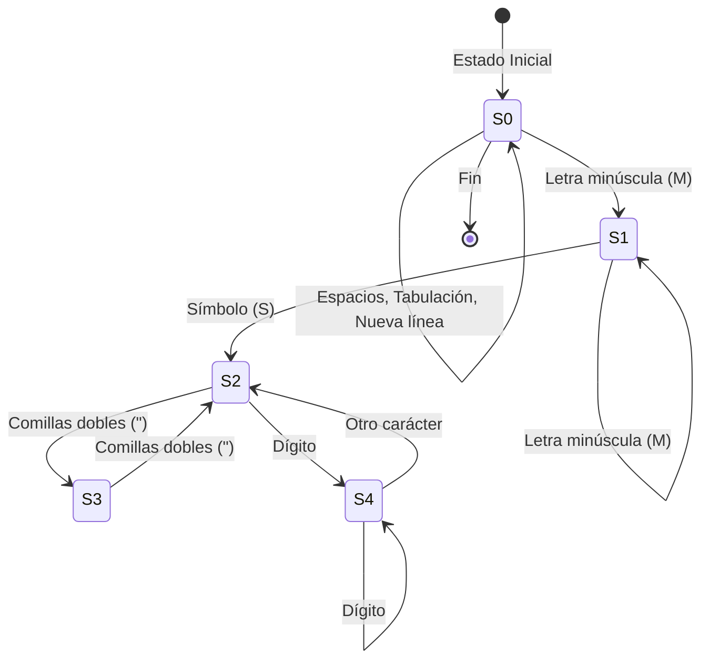

# Manual tecnico
###### *Natalia Garrido Carnet:202201385*

# introduccion 
por exceso de codigo solo se mostraran las partes mas importantes del codigo  que van enlazador a proximo uso, o para mostrar mas indispensables
### interfaz grafica 
la interfaz grafica fue hecha en tkinter 

conde se envia y se trae archivos 
1. envio de datos 
``` subprocess.run(
        ["gfortran", "-o", "main.exe", "main.f90"],  # Compilación de Fortran
        check=True  # Detener si hay un error en la compilación
    )
       # Ejecutar el programa Fortran y enviarle los datos directamente (sin archivo)
    subprocess.run(
        ["./main.exe"],  # Ejecutable de Fortran
        input=data,  # Enviar los datos a través de stdin
        text=True,  # Indicar que el input es texto (en lugar de bytes)
        check=True  # Detener si hay un error en la ejecución
    ) 
```
2. generar grafica

este codigo llama a un archivo dot que genero  se genero en fortran 

```
def generar_grafica():
    # Comprobar si el archivo DOT existe en la ruta actual
    dot_path = os.path.abspath("grafica.dot")
    print(f"Buscando archivo DOT en: {dot_path}")
    
    if os.path.exists(dot_path):
        # Usar Graphviz para generar la imagen del archivo DOT
        os.system('dot -Gsize=10,7.5 -Tpng grafica.dot -o grafica.png')
        mostrar_grafica('grafica.png')
    else:
        print("El archivo grafica.dot no existe.")
```

## analizador lexico

## Estados
- **S0**: Estado inicial
- **S1**: Lectura de minúsculas
- **S2**: Procesamiento de símbolos
- **S3**: Procesamiento de contenido dentro de comillas
- **S4**: Lectura de dígitos después de un símbolo

## Entradas
- **M**: Conjunto de caracteres en minúscula.
- **S**: Conjunto de símbolos (e.g., ':', ';').
- **N**: Conjunto de dígitos (0-9).
- **Espacio**: Espacio en blanco.
- **Tabulación**: Tab.
- **Nueva línea**: Retorno de carro o nueva línea 
- **"**: Comillas dobles.


```
do while (puntero <= len)   
    char = contenido(puntero:puntero)
                            
        ! Control de nueva línea, tabulación y espacio
        if (ichar(char) == 10) then
            columna = 1
            linea = linea + 1
            puntero = puntero + 1
        elseif (ichar(char) == 9) then
            columna = columna + 4
            puntero = puntero + 1
        elseif (ichar(char) == 32) then
            columna = columna + 1
            puntero = puntero + 1
        else
            select case (estado)
                case (0) ! Estado inicial, chequeo de minúscula
                    if (any(char == M)) then
                        estado = 1
                    else
                        numErrores = numErrores + 1
                        errores(numErrores) = TokenInfo(char, "Se esperaba una minúscula", columna, linea)
                        puntero = puntero + 1
                    end if
                case (1) ! Estado de lectura de minúsculas
                    if (any(char == M)) then
                        tkn = trim(tkn) // char
                        columna = columna + 1
                        puntero = puntero + 1
                    elseif (any(char == S)) then
                        ! Estado de transición, se encuentra un símbolo
                        if (es_palabra_reservada(tkn)) then
                            numTokens = numTokens + 1
                            tokens(numTokens) = TokenInfo(trim(tkn), "Palabra reservada", columna, linea)
                        else
                            numErrores = numErrores + 1
                            errores(numErrores) = TokenInfo(trim(tkn), "No es una palabra reservada", columna, linea)
                        end if
                        tkn = ""
                        estado = 2
                    else
                        numErrores = numErrores + 1
                        errores(numErrores) = TokenInfo(char, "Caracter inesperado", columna, linea)
                        puntero = puntero + 1
                    end if
                case (2) ! Estado de procesamiento de símbolos
                    if (char == '"') then
                        ! Procesar contenido dentro de comillas
                        estado = 3
                        puntero = puntero + 1
                    elseif (any(char == S)) then
                        ! Si es un símbolo permitido, guardarlo
                        numTokens = numTokens + 1
                        tokens(numTokens) = TokenInfo(char, "Signo", columna, linea)
                        columna = columna + 1
                        puntero = puntero + 1
                    elseif (any(char == M)) then
                        ! Si es una letra después del signo, volver al estado 1
                        estado = 1
                    else
                        ! Nuevo estado para leer dígitos después de un símbolo
                        estado = 4
                        tkn = tkn // char
                        columna = columna + 1
                        puntero = puntero + 1
                    end if
                case (3) ! Estado de ignorar contenido dentro de comillas
                    if (char == '"') then
                        ! Termina la lectura de la cadena, volver al estado de símbolos
                        estado = 2
                    end if
                    ! Aumentar columna durante la lectura de las comillas
                    columna = columna + 1
                    puntero = puntero + 1
                case (4) ! Nuevo estado para leer dígitos después de un símbolo
                    if (any(char == N)) then
                        tkn = tkn // char
                        columna = columna + 1
                        puntero = puntero + 1
                    else
                        ! Termina la lectura de los dígitos, volver al estado de símbolos
                        estado = 2
                    end if
            end select               
``` 
## llenar lsitas
se llena listas de tipo continenete y de tipo pais 

siendo este el metodo  de guardado y de identificacion 

```
do while (pos_inicio <= len_contenido)
        ! Encontrar la posición del siguiente salto de línea
        pos_fin = index(contenido(pos_inicio:), new_line('a'))

        if (pos_fin == 0) then
            ! Si no hay más saltos de línea, toma el resto del contenido
            line = trim(contenido(pos_inicio:))
            pos_inicio = len_contenido + 1
        else
            ! Extraer una línea del contenido
            line = trim(contenido(pos_inicio:pos_inicio + pos_fin - 2))
            pos_inicio = pos_inicio + pos_fin
        end if

        ! Procesar la línea
        if (index(line, 'grafica') > 0) then
            contieneGrafica = .true.
            contieneCont = .false.
            contienePais = .false.
        elseif (index(line, 'continente') > 0) then
            contieneCont = .true.
            contienePais = .false.
            num_continentes = num_continentes + 1
            call agregar_continente(lista_cont, num_continentes)  ! Agregar nuevo continente
            print *, 'Abre continente'

            

        elseif (index(line, 'pais') > 0) then
            contienePais = .true.
            print*,'abre pais '
            num_paises = num_paises + 1
            call agregar_pais(lista_paises, num_paises)
        elseif (index(line, 'nombre') > 0) then
            if (contieneGrafica .and. .not. contieneCont .and. .not. contienePais) then
                print *, 'Se encontró el nombre del gráfico'
                nombreGrafica=trim(extraer_valor(line))
            elseif (contieneGrafica .and. contieneCont .and. .not. contienePais) then
                print *, 'Se encontró nombre del continente'
                lista_cont(num_continentes)%nombre = trim(extraer_valor(line))
            elseif (contieneGrafica .and. contieneCont .and. contienePais) then
                print *, 'Se encontró nombre del país'
                lista_paises(num_paises)%nombre = trim(extraer_valor(line))
            end if
        elseif (index(line, '}') > 0) then
            if (contieneGrafica .and. contieneCont .and. contienePais) then
                print *, 'Se cierra país'
                contienePais = .false.
            elseif (contieneGrafica .and. contieneCont .and. .not. contienePais) then
                print *, 'se cierra continente'
                lista_cont(num_continentes)%paises = lista_paises  ! Asignar la lista de países al continente
            contieneCont = .false.
            num_paises = 0  ! Reiniciar la cuenta de países para el próximo continente
            deallocate(lista_paises)  ! Liberar la lista actual de países
            allocate(lista_paises(1))  ! Reasignar espacio para el próximo continente
                contieneCont = .false.
            elseif (contieneGrafica .and. .not. contieneCont .and. .not. contienePais) then
                print *, 'Se cierra gráfica'
                contieneGrafica = .false.
            end if
        elseif (index(line, 'poblacion') > 0) then
            if (contieneGrafica .and. contieneCont .and. contienePais) then
                print *, 'Se encontró población'
                valor = trim(extraer_valor(line))
                read(valor, *) lista_paises(num_paises)%poblacion
            end if
        elseif (index(line, 'saturacion') > 0) then
            if (contieneGrafica .and. contieneCont .and. contienePais) then
                print *, 'Se encontró saturación'
                charPor = trim(extraer_valor(line))
                valorS = extraer_porcentaje(charPor) 
                lista_paises(num_paises)%saturacion = valorS
            end if
        elseif (index(line, 'bandera') > 0) then
            if (contieneGrafica .and. contieneCont .and. contienePais) then
                print *, 'Se encontró bandera'
                lista_paises(num_paises)%bandera = trim(extraer_valor(line))
            end if
        end if

        print *, trim(line)
    end do
```