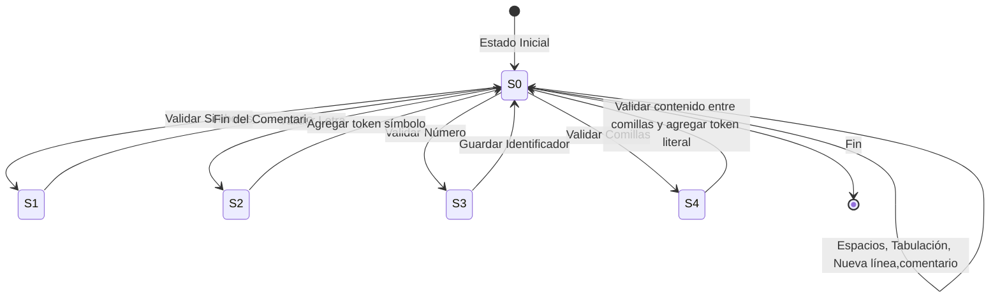
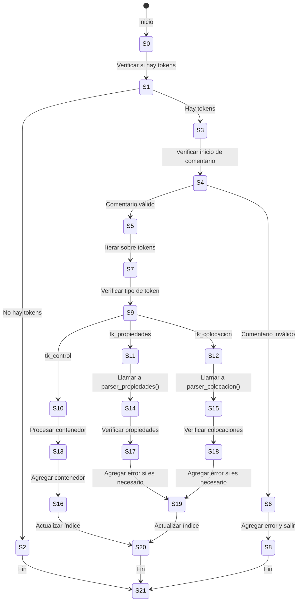

Manual tecnico
Natalia Garrido Carnet:202201385
introduccion
por exceso de codigo solo se mostraran las partes mas importantes del codigo que van enlazador a proximo uso, o para mostrar mas indispensables

interfaz grafica
la interfaz grafica fue hecha en tkinter

conde se envia y se trae archivos
```
def enviar_datos():
    data = texto.get("1.0", tk.END)
    
    # Compilar el programa Fortran
    subprocess.run(
        ["gfortran", "-o", "main.exe", "main.f90"],  # Compilación de Fortran
        check=True  # Detener si hay un error en la compilación
    )
    
    # Ejecutar el programa Fortran y enviarle los datos directamente (sin archivo)
    resultado = subprocess.run(
        ["./main.exe"],  # Ejecutable de Fortran
        input=data,  # Enviar los datos a través de stdin
        text=True,  # Indicar que el input es texto (en lugar de bytes)
    )
    
    for row in tree.get_children():
        tree.delete(row)
    limpiar_tabla()
    # Cargar errores en la tabla
    cargar_errores()
```
esta se puede considerar la parte mas importante del area de interfaz que es la conexion entre la interfaz y el main de fortran en este tambien se encuentra tabla errores.txt y tokens.txt

## area de analizador lexico



al ser el codigo muy largo solo se dejara el adf y como es el case 0 que conecta a todos los demas 
```
case (0)
            
        
            ! Detectar comentarios de línea (//)
            if (char == '/') then
                puntero = puntero + 1
                char = contenido(puntero:puntero)  ! Avanza al siguiente carácter
        
                if (char == '/') then
                    print*,' Comentario de línea, ignorar hasta el fin de línea'

                    do while (ichar(char) /= 10)  ! 10 es el código ASCII para nueva línea
                        puntero = puntero + 1
                        char = contenido(puntero:puntero)
                    end do
                    fila = fila + 1
                    columna = 0
                    estado = 0
        
                    elseif (char == '*') then
                        ! Comentario de bloque, ignorar hasta encontrar */
                        print*,'abre comentario de bloque '
                        do
                            puntero = puntero + 1
                            
                            ! Verifica que puntero no exceda la longitud
                            if (puntero > len) then
                                call agregar_error('/*', '*/', fila, columna)
                                exit  ! Error: Comentario de bloque no cerrado
                            end if
                            
                            char = contenido(puntero:puntero)
                    
                            if (char == '*') then
                                puntero = puntero + 1
                                
                                ! Verifica nuevamente
                                if (puntero > len) then
                                    call agregar_error('/*', '*/', fila, columna)
                                    exit  ! Error: Comentario de bloque no cerrado
                                end if
                                
                                char = contenido(puntero:puntero)
                                
                                if (char == '/') then
                                    print*,'cierra comentario de bloque'
                                    puntero = puntero + 1
                                    exit  ! Fin del comentario de bloque
                                end if
                            elseif (ichar(char) == 10) then
                                ! Salto de línea dentro del comentario
                                fila = fila + 1
                                columna = 0
                            end if
                        end do
                        estado = 0
        
                else
                    ! No era comentario, proceso normal
                    estado = 1
                    columna = columna + 1
                end if
        
            ! Verifica que el carácter sea un símbolo
            elseif (char == ';' .or. char == '-' .or. char == '.' .or. &
                    char == '(' .or. char == ')' .or. char == ',' .or. &
                    char == '<' .or. char == '>' .or. char == '!') then
                estado = 1
                columna = columna + 1
        
            elseif (char >= 'A' .and. char <= 'Z' .or. (char >= 'a' .and. char <= 'z')) then
                estado = 2  ! Iniciamos la construcción de un identificador o palabra clave
        
            elseif (char >= '0' .and. char <= '9') then
                estado = 3  ! Estado para construir números
        
            elseif (char == '"') then
                    aux_tkn = ""  ! Iniciar el token literal sin comillas
                    columna = columna + 1
                    puntero = puntero + 1
                    estado = 4 
        
            elseif (ichar(char) == 10) then
                ! Salto de línea
                columna = 0
                fila = fila + 1
                puntero = puntero + 1
        
            elseif (ichar(char) == 9) then
                ! Tabulación
                columna = columna + 4
                puntero = puntero + 1
        
            elseif (ichar(char) == 32) then
                columna = columna + 1
                puntero = puntero + 1
        
            ! Si el carácter es inválido (no está en el conjunto permitido)
            else
                call agregar_error(char, 'Simbolo valido', fila, columna)
                columna = columna + 1
                puntero = puntero + 1
            end if
```

## area de analizador sintactico

esta area del codigo es demasiado largo por lo que que pondremos olo una parte y este sera del tk colocacion al verificar este segmento del codigo se uso utras tecnicas como en control o propiedades pero de una manera mas corta
```
subroutine parser_colocacion(i)
        integer :: i, j
    
        ! Verifica el inicio de la colocación
        if (token_array(i)%tipo .ne. 'tk_menor' .or. token_array(i+1)%tipo .ne. 'tk_exp' .or. &
            token_array(i+2)%tipo .ne. 'tk_guion' .or. token_array(i+3)%tipo .ne. 'tk_guion') then
            call agregar_error(token_array(i)%lexema, 'tk_comentario', &
                               token_array(i)%fila, token_array(i)%columna)
            
        end if
        print*, 'no hay problema con <!--Colocacion'
    
        ! Loop sobre los tokens, comenzando desde el índice i + 4
        DO i = i + 4, size(token_array)
    
            if (token_array(i)%tipo == 'tk_colocacion') then
                j = i + 1
                print *, 'hay colocaciones'
    
                ! Loop para procesar múltiples colocaciones
                DO WHILE (j < size(token_array) .and. token_array(j)%tipo .ne. 'tk_colocacion') 
                    if (token_array(j)%tipo == 'tk_id' .and. token_array(j+1)%tipo == 'tk_punto') then
                        
                        ! Procesar setPosicion
                         if(token_array(j+2)%tipo == 'tk_setPosicion') then
                            if (token_array(j+3)%tipo .ne. 'tk_par_izq') then
                            call agregar_error(token_array(j+3)%lexema, 'tk_par_izq', &
                                                   token_array(j+3)%fila, token_array(j+3)%columna)
    
                            elseif (token_array(j+4)%tipo .ne. 'tk_num') then
                                call agregar_error(token_array(j+4)%lexema, 'tk_num', &
                                                   token_array(j+4)%fila, token_array(j+4)%columna)
    
                            elseif (token_array(j+5)%tipo .ne. 'tk_coma') then
                                call agregar_error(token_array(j+5)%lexema, 'tk_coma', &
                                                   token_array(j+5)%fila, token_array(j+5)%columna)
    
                            elseif (token_array(j+6)%tipo .ne. 'tk_num') then
                                call agregar_error(token_array(j+6)%lexema, 'tk_num', &
                                                   token_array(j+6)%fila, token_array(j+6)%columna)
    
                            elseif (token_array(j+7)%tipo .ne. 'tk_par_der') then
                                call agregar_error(token_array(j+7)%lexema, 'tk_par_der', &
                                                   token_array(j+7)%fila, token_array(j+7)%columna)
    
                            elseif (token_array(j+8)%tipo .ne. 'tk_pyc') then
                                call agregar_error(token_array(j+8)%lexema, 'tk_pyc', &
                                                   token_array(j+8)%fila, token_array(j+8)%columna)
    
                            else
                                print*, 'sin errores en setPosicion'
                                j = j + 8  ! Actualiza j para avanzar
                            end if
                            
                        end if
                        if(token_array(j+2)%tipo == 'tk_add') then
                            if (token_array(j+3)%tipo .ne. 'tk_par_izq') then
                                call agregar_error(token_array(j+3)%lexema, 'tk_par_izq', &
                                                   token_array(j+3)%fila, token_array(j+3)%columna)
                            elseif (token_array(j+4)%tipo .ne. 'tk_id') then
                            call agregar_error(token_array(j+4)%lexema, 'tk_id', &
                                                token_array(j+4)%fila, token_array(j+4)%columna)
                            elseif (token_array(j+5)%tipo .ne. 'tk_par_der') then
                                call agregar_error(token_array(j+5)%lexema, 'tk_par_der', &
                                                    token_array(j+5)%fila, token_array(j+5)%columna)
    
                            elseif (token_array(j+6)%tipo .ne. 'tk_pyc') then
                                call agregar_error(token_array(j+6)%lexema, 'tk_pyc', &
                                                    token_array(j+6)%fila, token_array(j+6)%columna)
    
                            else
                                print*, 'sin errores en setPosicion'
                                j = j + 6  ! Actualiza j para avanzar
                            end if
                        end if
                    elseif  (token_array(j)%tipo == 'tk_this' .and. token_array(j+1)%tipo == 'tk_punto') then
                        if(token_array(j+2)%tipo == 'tk_add') then
                            if (token_array(j+3)%tipo .ne. 'tk_par_izq') then
                                call agregar_error(token_array(j+3)%lexema, 'tk_par_izq', &
                                                   token_array(j+3)%fila, token_array(j+3)%columna)
                            elseif (token_array(j+4)%tipo .ne. 'tk_id') then
                            call agregar_error(token_array(j+4)%lexema, 'tk_id', &
                                                token_array(j+4)%fila, token_array(j+4)%columna)
                            elseif (token_array(j+5)%tipo .ne. 'tk_par_der') then
                                call agregar_error(token_array(j+5)%lexema, 'tk_par_der', &
                                                    token_array(j+5)%fila, token_array(j+5)%columna)
    
                            elseif (token_array(j+6)%tipo .ne. 'tk_pyc') then
                                call agregar_error(token_array(j+6)%lexema, 'tk_pyc', &
                                                    token_array(j+6)%fila, token_array(j+6)%columna)
    
                            else
                                print*, 'sin errores en setPosicion'
                                j = j + 6  ! Actualiza j para avanzar
                            end if
                        end if
                        ! Aquí puedes agregar condiciones similares para otros métodos de colocación
                    end if
                    j = j + 1  ! Avanza al siguiente token para seguir buscando
                END DO
                
                if (j < size(token_array) .and. token_array(j)%tipo == 'tk_colocacion') then
                    print*, 'Se encontró otro tk_colocacion, saliendo del bucle.'
                    exit  ! Salir del bucle
                end if
            end if
        END DO
        
        print*,' luego de parser_colocacion', j
        i = j
        print*,'valor i ', i
    
        if (token_array(i)%tipo .ne. 'tk_colocacion' .or. &
            token_array(i+1)%tipo .ne. 'tk_guion' .or. &
            token_array(i+2)%tipo .ne. 'tk_guion' .or. &
            token_array(i+3)%tipo .ne. 'tk_mayor') then
            call agregar_error(token_array(i)%lexema, 'tk_colocacion -->', &
                               token_array(i)%fila, token_array(i)%columna)
    
        else 
            i = j + 3
            ! Llama a la siguiente subrutina, si es necesario
            ! call parser_siguiente(i+1)
        end if
        call imprimir_errores()
    end subroutine parser_colocacion
```