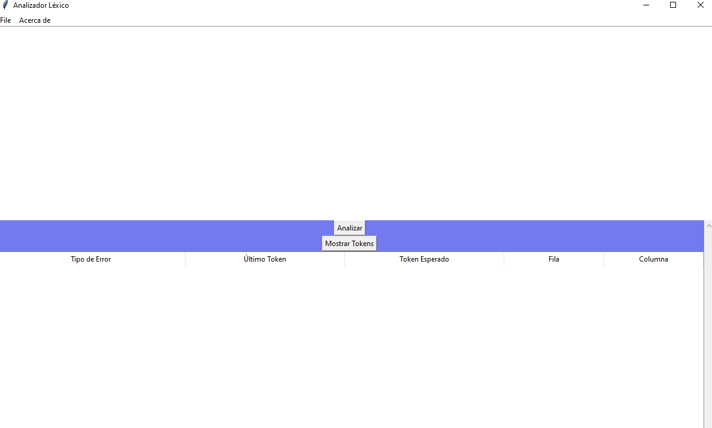
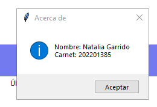
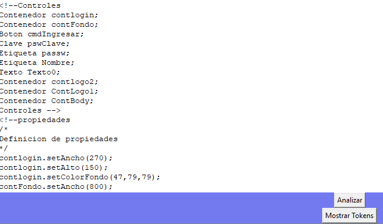
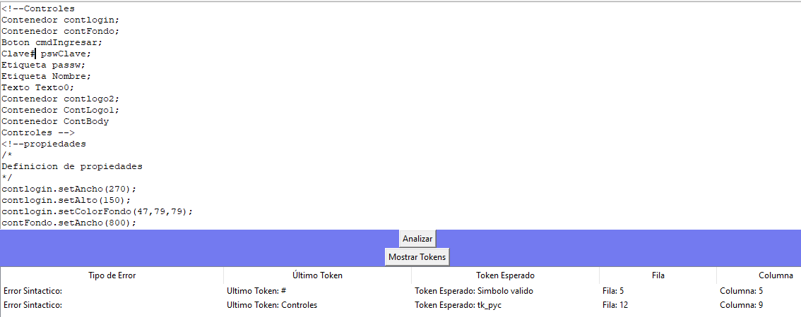

# Manual de usuario 
###### Natalia Garrido  carnet 202201385 
## introduccion 
a continuacion se le presentara el uso de una interfaz en el cual lee un cierto tipo de documento, este en su backend considerara su analisis lexico y sintactico donde se desea poder generar el orden correcto de analisis y asi mismo con este generar una pagina html con css incluido

## inicio
Lo que encontraremos en el  la interfaz sera lo siguiente 

esta vendria siendo como se visualiza el area de menu donde puedes abrir archivo guardarlo y guardar como 

 
 en la parte superior podemos encontrar un menu con varias partes  hablaremos de esas 
 

 - open 
	 - en esta se abre un archivo que tengamos guardado y lo imprime o lo muestra en el area de texto 
- save
	- esta parte guarda lo que tengamos en el area de texto
- save as
	- esta parte nos permite elegir como y donde guardar lo que tengamos en el area de texto 
- exit 
	- al apachar esta area lo que hace es que cierra el programa 
- acerca de 
	-  en esta area encontraran los datos del estudiante
 
### area de trabajo 

en esta encontraremos  
- *area de texto*
	- aca se mostrara los archivos leidos y puede ser modificado 
- *boton analizar*
- *boton mostrar tokens*

### area de tokens

al dar click en el boton analizar  y luego mostrar tokens genera los tokens validos encontrados y guardados

### area de errores en los tokens

al dar click en el boton analizar y haya errores tanto sintacticos como lexicos en el programa generara error y estos apareceran en la tabla

con su respetico 
- ultimo token
- token esperado
- fila
- columna
